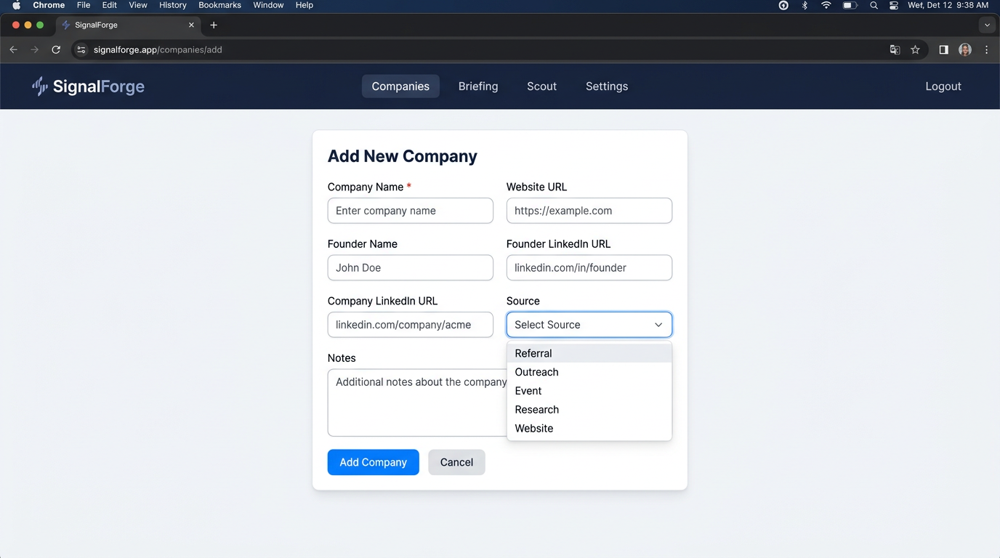

# SignalForge User Guide

This guide is for people who **use** SignalForge: logging in, managing companies, viewing briefings, running Scout, recording outreach, and adjusting settings. All steps and screens described here match the application as built.

---

## What SignalForge Does

SignalForge is a **single-user intelligence assistant** that monitors startup companies and identifies when founders are likely to need technical leadership help (e.g. fractional CTO). It does **not** send outreach automatically. It produces **recommendation kits** (drafts, rationale, safeguards) for you to review and use. The flow is: **companies → signals → analysis → scoring → briefing → outreach draft**. You always decide what to send and when.

---

## User Onboarding

### Logging in

1. Open the app in your browser (e.g. `http://localhost:8000` or your deployment URL).
2. You are redirected to **Login** if not authenticated.
3. Enter your **username** and **password** and submit.
4. On success you are redirected to **Companies** (the main list).

To log out, use **Logout** in the top navigation. Your session is stored in a cookie (HTTP-only, 24 hours).

### Main areas (navigation)

After login, the top bar shows:

| Link        | Purpose |
|------------|---------|
| **Companies** | List, add, import, and manage companies; run scans. |
| **Briefing**  | Daily briefing: top companies, outreach drafts, emerging list. |
| **Scout**     | Run discovery (ICP-based) and view evidence bundles. |
| **Settings**   | Briefing time/frequency/email, scoring weights, run ingest, profile, recent jobs, Bias Reports. |
| **Logout**     | End your session. |

**Bias Reports** are reached from **Settings** (button “Bias Reports”), not from the main nav.

If your instance uses **multiple workspaces**, some pages may show or require a `workspace_id` in the URL. All data you see is scoped to your workspace.

---

## Key concepts (plain language)

- **Company** — A startup you are tracking. You add it manually or via import; optionally with website URL, founder name, LinkedIn URLs, notes.
- **Scan** — For companies with a website URL: the app discovers pages, extracts text, runs AI analysis, and updates a **readiness score** and **stage**. You can “Scan all” from the Companies page or rescan a single company from its detail page.
- **Briefing** — A daily (or weekly) view of top companies with **outreach drafts** (subject + message). Briefing is generated by a job (cron or “Generate” on the Briefing page). You can view today’s briefing or pick a date; you can sort by score, recent, last outreach, or outreach score.
- **Outreach** — The app **never sends** outreach for you. It produces draft text. You copy it, send it yourself (email, LinkedIn, etc.), and then **record** what you sent (and optionally the outcome) on the company’s detail page.
- **Scout** — A separate discovery flow: you describe your ideal customer profile (ICP) and optional exclusion rules; the app fetches pages and uses AI to produce **evidence bundles** (candidate company, website, hypothesis, evidence). Scout does not create or update companies in your list.
- **TRS / ESL** — Technical Readiness Score (how ready/complex a company’s situation is) and Engagement Suitability Layer (whether and how intensely to suggest outreach). These drive ranking and recommendation type; the UI shows scores and bands where relevant.

For more terms (TRS, ESL, ORE, etc.), see [GLOSSARY.md](GLOSSARY.md).

---

## Task-based tutorials

### 1. Add a company

1. Go to **Companies**.
2. Click **Add company** (or open `/companies/add`).
3. Fill the form:
   - **Company name** (required).
   - **Website URL** (optional; needed if you want scans).
   - **Founder name**, **Founder LinkedIn URL**, **Company LinkedIn URL**, **Notes** (optional).
   - **Source**: Manual, Referral, or Research.
4. Click **Add Company**.
5. You are redirected to the **company detail** page for the new company.

Validation: company name is required; any URL field you fill must be a valid http(s) URL.

---

### 2. Bulk import companies

1. Go to **Companies** → **Import** (or `/companies/import`).
2. Use **one** of:
   - **CSV upload**: Choose a `.csv` file. Required column: `company_name`. Optional columns: `website_url`, `founder_name`, `founder_linkedin_url`, `company_linkedin_url`, `notes`.
   - **JSON paste**: Paste a JSON array of objects with the same field names, e.g.  
     `[{"company_name": "Acme Corp", "website_url": "https://acme.example.com"}]`.
3. Click **Import Companies**.
4. The page shows **Import results**: total, created, skipped (duplicates), errors. If there are rows, a table lists each row with status and detail.

You must provide either a CSV file or JSON data; otherwise you get a validation error.

---

### 3. Edit a company

1. Go to **Companies** and open a company (click its name).
2. Click **Edit** (or go to `/companies/{id}/edit`).
3. Update **Company name**, **Website URL**, **Founder name**, **Founder/Company LinkedIn URLs**, **Notes**, **Source**, and if shown **Target profile match** and **Current stage**.
4. Click **Save** (or equivalent submit).
5. You are redirected to the company detail page with a “Company updated” message.

Same validation as add: company name required; URLs must be valid if present.

---

### 4. Run Scan All or rescan one company

**Scan All (all companies with websites)**

1. Go to **Companies**.
2. Click **Scan all**. If a full scan is already running, you see a message that a scan is already running and to check Settings for progress.
3. If queued, you see “Scan all queued. Check Settings for progress.” The scan runs in the background; **Settings** → **Recent Job Runs** shows type `scan`, status, and times.

**Rescan one company**

1. Open the **company detail** page.
2. Click **Rescan**. If a scan is already running for that company, you see “rescan: running”; otherwise the rescan is queued and you see “rescan: queued.”
3. Progress is reflected in the same company detail page (e.g. latest scan job) and in **Settings** → **Recent Job Runs**.

Scans only run for companies that have a **website URL**. The app discovers pages (blog, jobs, careers, etc.), extracts text, runs AI analysis, and updates the company’s score and stage.

---

### 5. View and use the Daily Briefing

1. Go to **Briefing** (or `/briefing`). You see **today’s** briefing by default.
2. **Date**: Use **Previous** / **Next** to open another date (`/briefing/YYYY-MM-DD`). “Next” is only shown for dates before today.
3. **Sort**: Use the sort links to order by **Score**, **Recent**, **Last outreach**, or **By outreach score**.
4. **Content**: Each briefing card shows company name (link to detail), founder, score badge, stage, summary, and if present **outreach subject and message** with a **Copy Outreach** button to copy subject + message.
5. **Generate**: If no briefing exists or you want to regenerate, click **Generate**. This triggers the briefing job; you may see an error flash if generation fails, or a note that the last briefing job had failures (with a link to Settings). After generating, you stay on the briefing page.
6. **Emerging companies**: The page may show an “Emerging” section with companies ranked for outreach score and indicators (e.g. cooldown, stability cap, sensitivity). Use these to decide who to contact and how.

The briefing is built from the lead feed or snapshots; “Generate” runs the same logic as the internal briefing job (select top companies, generate items and outreach drafts). Nothing is sent automatically.

---

### 6. Run Scout and view results

**Start a Scout run**

1. Go to **Scout**.
2. Click **New run** (or `/scout/new`).
3. Fill the form:
   - **ICP definition** (required): Describe your ideal customer profile (e.g. stage, sector, technical needs).
   - **Exclusion rules** (optional): Domains or criteria to exclude.
   - **Page fetch limit** (optional): 0–100; default 10 (max URLs to fetch).
4. Click **Start Scout run**. You are redirected to the Scout list with “Scout run started.”
5. The run executes; when it finishes, it appears in the list with status and bundle count.

**View Scout runs**

1. Go to **Scout**. You see a list of runs (newest first) with run ID, started time, status, and number of bundles.
2. Click a run to open **Run detail** (`/scout/runs/{run_id}`).
3. Run detail shows run metadata and a list of **bundles**. Each bundle has: candidate company name, company website, “why now” hypothesis, and evidence list. No raw AI output is shown in the UI.

Scout does **not** create or update companies in your Companies list. It only produces evidence bundles for review.

---

### 7. Record outreach (add, edit outcome, delete)

Outreach is recorded **per company** on the company detail page. The app may show a **draft** (from the latest briefing) for pre-fill; you still send messages yourself and then log them.

**Add an outreach record**

1. Open the **company detail** page.
2. In the outreach section, fill:
   - **Sent date/time** (required), **Outreach type** (required): email, linkedin_dm, warm_intro, or other.
   - **Outcome** (optional): replied, declined, no_response, or other.
   - **Message** and **Notes** (optional).
3. Submit the form. If cooldown rules block recording, you see an error message; otherwise you see “Outreach recorded.”

**Edit outcome**

1. On the same company detail page, find the outreach record in the history table.
2. Use the **Edit** form for that row: set **Outcome** and submit. You see “Outcome updated.”

**Delete an outreach record**

1. In the outreach history, click **Delete** for that record.
2. Confirm in the browser dialog. You are redirected back with “Outreach deleted.”

Outreach history and draft are scoped to the current workspace when the app uses multiple workspaces.

---

### 8. Settings

Go to **Settings** (`/settings`).

**Briefing and email**

- **Briefing time**: Time of day for briefing generation (24h, e.g. 08:00). Required.
- **Briefing frequency**: Daily or Weekly. If Weekly, choose **day of week** (Monday–Sunday).
- **Enable briefing email**: Check to send the briefing to the email below when generation completes.
- **Briefing email**: Address for delivery (SMTP is configured via environment).

**Scoring**

- **Scoring weights (JSON)**: Optional custom signal weights. Keys can include: `hiring_engineers`, `switching_from_agency`, `adding_enterprise_features`, `compliance_security_pressure`, `product_delivery_issues`, `architecture_scaling_risk`, `founder_overload`. Must be valid JSON; leave `{}` or empty to use defaults.

**Other**

- **Active Signal Pack**: Read-only; shows the pack name, id, and version. Pack changes apply only to new observations.
- **Scan change rate**: Last 30 days — percentage of companies with analysis changes. Helps tune how often to run scans.
- **Recent Job Runs**: Table of recent jobs (type, status, started/finished, processed count, error). Use **Run ingest** to queue an ingest job (disabled if ingest is already running). If the last ingest completed with 0 companies, an explanation is shown (e.g. no adapters configured or no events in range).
- **Edit Operator Profile**: Link to **Settings → Profile** (`/settings/profile`). Profile content is used by the AI to personalize outreach; you can paste or edit text and save (max length 50KB).

---

### 9. Bias reports

1. Go to **Settings** and click **Bias Reports** (or `/bias-reports`).
2. **List**: Reports are listed newest first (e.g. last 50). Each row shows report month and a **View** link.
3. **Run audit**: Click **Run bias audit** to generate a new report. You are redirected back with a success message (e.g. “Report generated for N companies”) or an error.
4. **View report**: Click **View** on a report to open its detail page: report month and full payload (structure depends on the audit implementation).

---

## Where things run (jobs)

- **Scan (all or single company)**: Triggered from the UI; runs in the background. Status in Settings → Recent Job Runs.
- **Briefing**: Triggered by “Generate” on the Briefing page or by an internal/cron job. Status in Recent Job Runs; failures are indicated on the Briefing page.
- **Ingest**: Triggered from Settings → “Run ingest” or by an internal/cron job. Fetches events from external APIs (e.g. Crunchbase, Product Hunt) and normalizes them; does not create companies by itself unless your pipeline resolves events to companies.
- **Bias audit**: Triggered from Bias Reports → “Run bias audit”; runs synchronously and redirects with result.

Internal/cron endpoints (e.g. `POST /internal/run_scan`, `POST /internal/run_briefing`) require the internal token and are not for normal user use.

---

## Getting more help

- **Terms and acronyms**: [docs/GLOSSARY.md](GLOSSARY.md)
- **Pipeline and technical behavior**: [docs/pipeline.md](pipeline.md)
- **Developer onboarding** (codebase, data flow): [docs/DEVELOPER_ONBOARDING.md](DEVELOPER_ONBOARDING.md)
