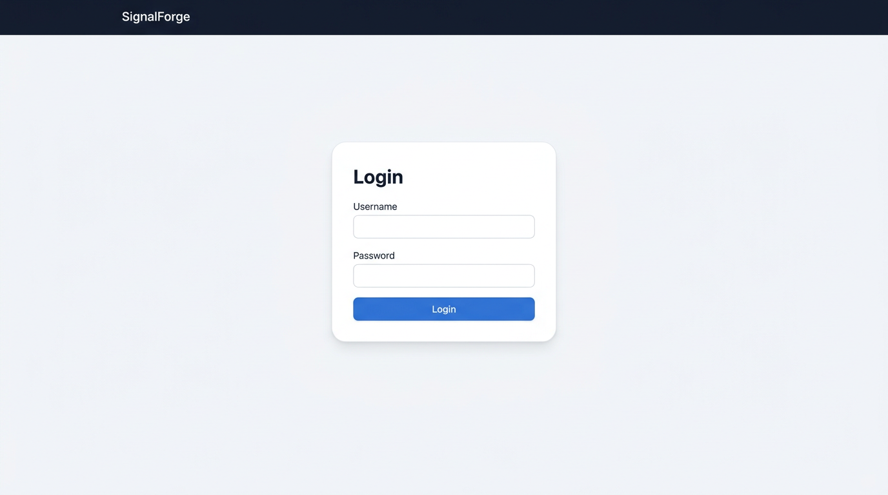
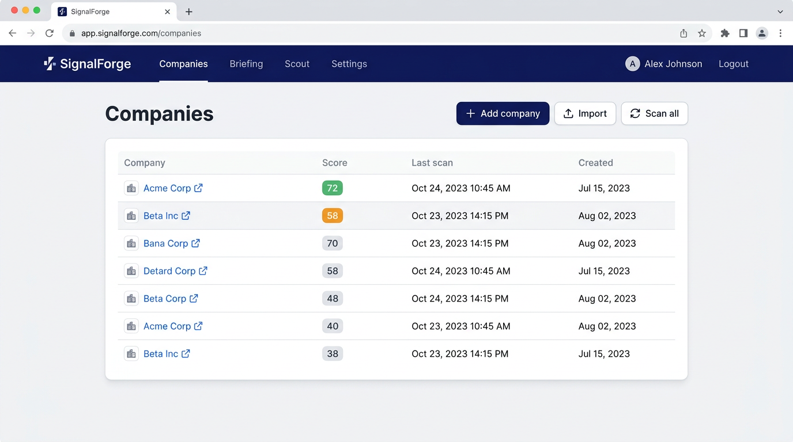
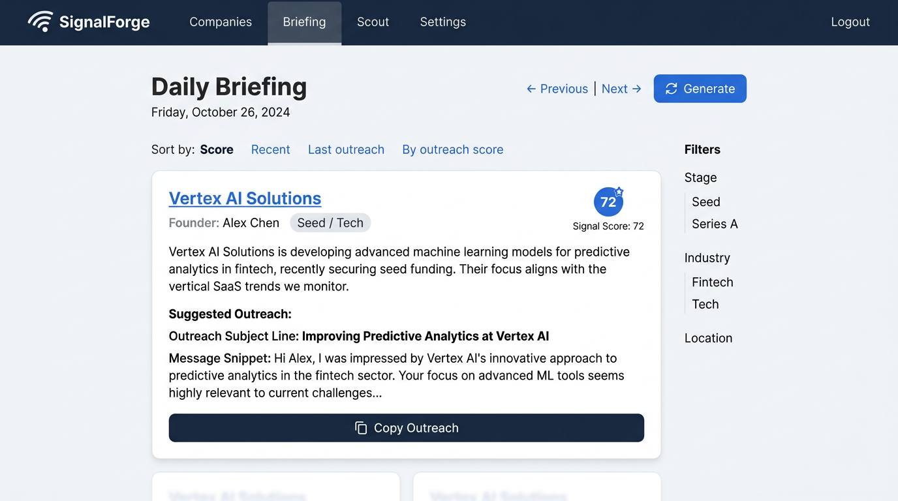

# SignalForge — User onboarding (quick start)

Get started with SignalForge in a few steps. For full task-based tutorials and details, see [USER_GUIDE.md](USER_GUIDE.md).

---

## 1. Log in

Open the app URL, enter your **username** and **password**, and submit. You’ll land on **Companies**.

---

## 2. Add or import companies

- **Add one**: **Companies** → **Add company**. Fill at least **Company name**; add **Website URL**; add **Website URL** if you want the app to scan the site later.
- **Import many**: **Companies** → **Import**. Upload a CSV (required column: `company_name`) or paste a JSON array of objects with the same fields.

---

## 3. Get scores and drafts (optional)

- **Scan**: For companies with a website URL, use **Scan all** on the Companies page (or **Rescan** on a company’s detail page). Scans run in the background; check **Settings** → **Recent Job Runs** for status.
- **Briefing**: Go to **Briefing** and click **Generate** to build today’s briefing. Then view companies, scores, and **outreach drafts** (subject + message). Use **Copy Outreach** to copy; the app does not send anything for you.

---

## 4. Record what you send

When you contact a founder, log it on the **company detail** page: fill **Sent date/time**, **Outreach type** (email, LinkedIn DM, etc.), and optionally **Outcome** and **Message**/ **Notes**. This keeps history and feeds cooldown and reporting.

---

## 5. Adjust settings

**Settings** lets you set:

- **Briefing time** and **frequency** (daily or weekly), and optional **briefing email**.
- **Scoring weights** (advanced; JSON).
- **Operator profile** (used to personalize AI outreach drafts).

You can also **Run ingest** from Settings (to pull events from external sources) and open **Bias Reports** to run or view bias audits.

---

## Main navigation

| Page        | Use it for |
|------------|------------|
| **Companies** | List, add, import, edit, scan, delete companies; open company detail. |
| **Briefing**  | View/generate daily briefing; copy outreach drafts; see emerging companies. |
| **Scout**     | Start a discovery run (ICP + exclusions); view runs and evidence bundles. |
| **Settings**   | Briefing time/email, scoring, profile, recent jobs, Run ingest, Bias Reports. |

---

**Full guide**: [USER_GUIDE.md](USER_GUIDE.md) — onboarding, concepts, and step-by-step tutorials for every task.
